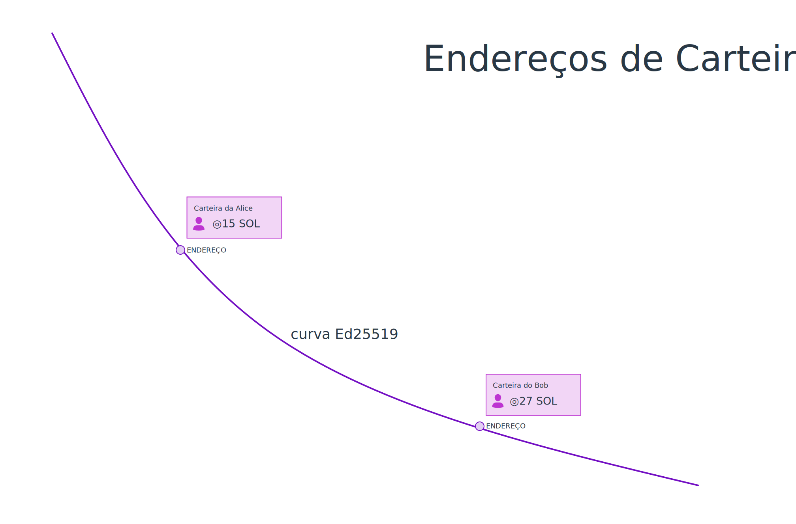

# Resumo

- Um **par de chaves** é um par correspondente de **chave pública** e **chave secreta**.
- A **chave pública** é usada como um "endereço" que aponta para uma conta na rede Solana. Uma chave pública pode ser compartilhada com qualquer pessoa.
- A **chave secreta** é usada para verificar a autoridade sobre a conta. Como o nome sugere, você deve sempre manter as chaves secretas *secretas*.
- `@solana/web3.js` fornece funções auxiliares para criar um novo par de chaves ou para construir um par de chaves usando uma chave secreta existente.

# Visão geral

## Criptografia Simétrica e Assimétrica

'Criptografia' é literalmente o estudo de esconder informações. Existem dois tipos principais de criptografia que você encontrará no dia a dia:
 
**Criptografia Simétrica** é a quando a mesma chave é usada para encriptar e desencriptar. Tem centenas de anos e foi usada por todos, desde os egípcios até a Rainha Elizabeth I.

Existe uma variedade de algoritmos de criptografia simétrica, mas os mais comuns que você vê por aí são AES e Chacha20.

**Criptografia Assimétrica**

- Criptografia Assimétrica - também chamada de '[criptografia de chave pública](https://pt.wikipedia.org/wiki/Criptografia_de_chave_p%C3%BAblica)' foi desenvolvida nos anos 1970. Na criptografia assimétrica, os participantes possuem **pares de chaves**. Cada par de chaves consiste em uma **chave secreta** e uma **chave pública**. A criptografia assimétrica funciona de maneira diferente da criptografia simétrica e pode fazer coisas diferentes:

- **Encriptação**: se for encriptado com uma chave pública, somente a chave secreta do mesmo par de chaves pode ser usada para lê-lo
- **Assinaturas**: se for encriptado com uma chave secreta, a chave pública do mesmo par de chaves pode ser usada para provar que o titular da chave secreta o assinou.
- Você pode ainda usar criptografia assimétrica para descobrir uma boa chave para usar para criptografia simétrica! Isso é chamado de **troca de chaves**, onde você usa suas chaves públicas e a chave pública do destinatário para chegar a uma chave de 'sessão'.
- Existe uma variedade de algoritmos de criptografia assimétrica, mas os mais comuns que você encontra hoje em dia são variantes de ECC ou RSA.

Encriptação assimétrica é muito popular: 
 - O seu cartão do banco tem uma chave secreta dentro dele, que é usada para assinar transações.

   O seu banco pode confirmar que você fez a transação conferindo ela com a chave pública correspondente.
 - Sites incluem uma chave pública em seus certificados, seu navegador usará essa chave pública para encriptar os dados (como informações pessoais, detalhes de autenticação e números de cartão de crédito) que ele envia para a página da web.

   O site possui a chave privada correspondente, então ele pode ler os dados.
 - O seu passaporte eletrônico foi assinado pelo país que o emitiu, para garantir que o passaporte não seja falsificado.

   O passaporte eletrônico pode confirmar isso usando a chave pública do país que o emitiu.
 - Os apps de mensagem do seu celular usam troca de chaves para fazer uma chave de sessão.

Resumindo, criptografia está em todo canto. Solana, assim como outros blockchains, é mais um exemplo de uso de criptografia.

## Solana usa chaves públicas como endereços



Pessoas participando da rede Solana possuem pelo menos um par de chaves. Na Solana:

- A **chave pública** é usada como um "endereço" que aponta para uma conta na rede Solana. Mesmo nomes amigáveis - como `example.sol` - apontam para endereços como `dDCQNnDmNbFVi8cQhKAgXhyhXeJ625tvwsunRyRc7c8`

- A **chave secreta** é usada para verificar a autoridade sobre o par de chaves. Se você tem a chave secreta de um endereço, você controla os tokens dentro daquele endereço. Por esse motivo, como o nome sugere, você deve sempre manter as chaves secretas *secretas*.

## Usando @solana/web3.js para gerar um par de chaves

Você pode usar o blockchain Solana tanto no navegador quanto no node.js com o módulo npm `@solana/web3.js`. Configure um projeto como você normalmente faria, e então [use `npm`](https://nodesource.com/blog/an-absolute-beginners-guide-to-using-npm/) para instalar `@solana/web3.js`

```
npm i @solana/web3.js
```

Nós veremos bastante sobre [web3.js](https://docs.solana.com/developing/clients/javascript-reference) gradualmente durante esse curso, mas você também pode checar a [documentação oficial do web3.js](https://docs.solana.com/developing/clients/javascript-reference).

Para enviar tokens, NFTS ou ler e escrever data na Solana, você precisa ter seu próprio par de chaves. Para criar um novo par, use a função `Keypair.generate()` do `@solana/web3.js`:

```typescript
import { Keypair } from "@solana/web3.js";

const keypair = Keypair.generate();

console.log(`A chave pública é: `, keypair.publicKey.toBase58());
console.log(`A chave privada é: `, keypair.secretKey);
```

## ⚠️ Não inclua chaves secretas no seu código fonte

Como o par de chaves pode ser gerado novamente a pertir da chave secreta, nós normalmente só armazenamos a chave secreta e restauramos o par de chaves a partir dela.

Adicionalmente, já que a chave secreta dá autoridade sobre o endereço, nós não armazenamos chaves secretas no código fonte. Ao invés disso, nós:

- Colocamos as chaves secretas em um arquivo `.env`
- Adicionamos o arquivo `.env` no `.gitignore` para que ele não seja enviado ao repositório.

## Carregando um par de chaves existente

Se você já possui um par de chaves e gostaria de usá-lo, você pode carregar um `Keypair` a partir de uma chave secreta existente armazenada no seu computador ou em um arquivo `.env`. No node.js, o pacote npm `@solana-developers/node-helpers` inclui algumas funções extras:

 - Para usar um arquivo `.env` use `getKeypairFromEnvironment()`
 - Para usar um arquivo Solana CLI use `getKeypairFromFile()`

```typescript
import * as dotenv from "dotenv";
import { getKeypairFromEnvironment } from "@solana-developers/node-helpers";

dotenv.config();

const keypair = getKeypairFromEnvironment("SECRET_KEY");
```

Você já sabe como criar e carregar pares de chaves! Vamos praticar o que aprendemos.

# Laboratório

### Instalação

Crie um novo diretório, instale TypeScript, Solana web3.js e esrun:

```bash
mkdir generate-keypair
cd generate-keypair
npm init -y
npm install typescript @solana/web3.js @digitak/esrun @solana-developers/node-helpers
```

Crie um novo arquivo chamado `generate-keypair.ts`

```typescript
import { Keypair } from "@solana/web3.js";
const keypair = Keypair.generate();
console.log(`✅ Par de chaves gerado!`)
```

Execute `npx esrun generate-keypair.ts`. Você deve ver o texto:

```
✅ Par de chaves gerado!
```

Cada `Keypair` tem as propriedades `publicKey` e `secretKey`. Atualize o arquivo com o seguinte código:

```typescript
import { Keypair } from "@solana/web3.js";

const keypair = Keypair.generate();

console.log(`A chave pública é: `, keypair.publicKey.toBase58());
console.log(`A chave secreta é: `, keypair.secretKey);
console.log(`✅ Concluído!`);
```

Execute `npx esrun generate-keypair.ts`. Você deve ver o texto:

```
A chave pública é:  764CksEAZvm7C1mg2uFmpeFvifxwgjqxj2bH6Ps7La4F
A chave secreta é:  Uint8Array(64) [
  (um monte de números) 
]
✅ Concluído!
```

## Carregando um par de chaves existente de um arquivo .env

Para garantir que a sua chave secreta se mantenha segura, nós recomendamos injetar a chave secreta utilizando um arquivo `.env`:

Crie um novo arquivo chamado `.env` com os conteúdos da chave que você gerou anteriormente:

```env
SECRET_KEY="[(um monte de números)]"
```

Agora nós podemos carregar o par de chaves a partir do ambiente. Atualize o arquivo `generate-keypair.ts`:

```typescript
import * as dotenv from "dotenv";
import { getKeypairFromEnvironment } from "@solana-developers/node-helpers";

dotenv.config();

const keypair = getKeypairFromEnvironment("SECRET_KEY");

console.log(
  `✅ Concluído! Nós carregamos nossa chave secreta de forma segura, usando um arquivo env!`
);
```

Execute `npx esrun generate-keypair.ts`. Você deve ver o seguinte resultado:

```text
✅ Concluído! Nós carregamos nossa chave secreta de forma segura, usando um arquivo env!`
```

Agora nós aprendemos sobre pares de chaves e como armazenar chaves secretas de forma segura na Solana. No próximo capítulo, nós vamos usá-las!
