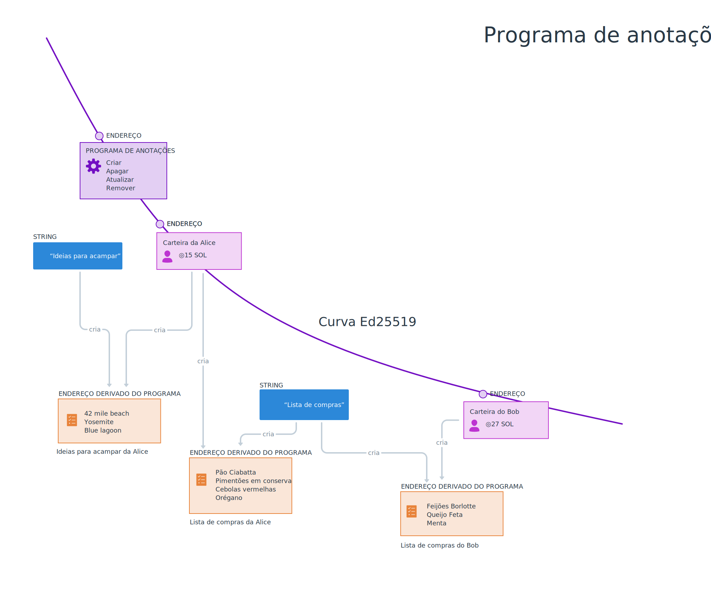

# Resumo

Todas as modificações feitas nos dados da rede acontecem por meio de **transações**. Transações são um conjunto de instruções que invocam programas Solana. Transações são atômicas, ou seja, elas podem executar com sucesso - se todas as instruções forem executadas corretamente - ou falhar, como se a transação não tivesse sido executada.

# Visão Geral

## Transações

Qualquer modificação nos dados da rede acontecem por meio de transações enviadas para programas.

Instruções de transações contém:

- um identificador do programa que você quer invocar
- um array de contas que podem ser lidas e/ou escritas
- dados estruturados como um array de bytes que é específico para o programa que está sendo invocado

Quando você envia uma transação para um cluster Solana, um programa Solana é invocado com as instruções incluídas na transação.

Como você deve imaginar, `@solana/web3.js` contém funções que auxiliam na criação de transações e instruções. Você pode criar uma nova transação com o construtor `new Transaction()`. Uma vez criado, você pode adicionar instruções para a traunsação usando o método `add()`.

Uma das funções auxiliares é a `SystemProgram.transfer()`, que cria uma instrução para transferir SOL:

```typescript
const transaction = new Transaction()

const sendSolInstruction = SystemProgram.transfer({
  fromPubkey: sender,
  toPubkey: recipient,
  lamports: LAMPORTS_PER_SOL * amount
})

transaction.add(sendSolInstruction)
```

A função `SystemProgram.transfer()` requer:

- uma chave pública correspondente a conta remetente
- uma chave pública correspondente a conta recipiente
- a quantia de SOL a ser enviada em lamports.

`SystemProgram.transfer()` retorna uma instrução para enviar SOL do remetente ao recipiente. Essa instrução pode ser adicionada a transação.

Uma vez que todas as instruções foram adicionadas, a transação precisa ser enviada ao cluster e confirmada:

```typescript
const signature = sendAndConfirmTransaction(
  connection,
  transaction,
  [senderKeypair]
)
```

A função `sendAndConfirmTransaction()` recebe os parâmetros:

- uma conexão ao cluster
- uma transação
- um array de pares de chaves que vão agir como signatários da transação - no nosso exemplo, teremos apenas um signatário: o remetente.

### Instruções

O exemplo de enviar SOL é uma ótima introdução para transações, mas muito do desenvolvimento web3 vai envolver invocar programas não-nativos. No exemplo acima, a função `SystemProgram.transfer()` garante que você passará todos os dados obrigatórios para criar a instrução e vai criar a instrução para você. Entretanto, quando trabalhamos com programas não-nativos, você precisará ser extremamente específico quando criar instruções para que elas sejam estruturadas de tal forma que possam ser utilizadas pelos programas correspondentes.

Usando `@solana/web3.js`, você pode criar instruções não-nativas com o construtor `TransactionInstruction`. Esse construtor recebe somente um argumento do tipo `TransactionInstructionCtorFields`.

```tsx
export type TransactionInstructionCtorFields = {
  keys: Array<AccountMeta>;
  programId: PublicKey;
  data?: Buffer;
};
```

Como podemos ver na definição acima, o objeto passado ao construtor `TransactionInstruction` requer:

- um array de chaves do tipo `AccountMeta`
- a chave pública do programa sendo invocado
- um `Buffer` opcional contendo os dados que serão encaminhados ao programa.

Por enquanto vamos ignorar o campo `data`, mas vamos revisitá-lo em uma lição futura.

O campo `programId` é um tanto quanto autoexplicativo: É a chave pública associada ao programa. Você precisa saber isso antes de invocar o programa da mesma forma que precisa saber a chave pública de alguém que você quer enviar SOL.

O array `keys` precisa de um pouco mais de explicação. Cada objeto no array representa uma conta que será lida ou modificada durante a execução da transação. Isso significa que você precisa saber o comportamento do programa que está invocando e garantir que está fornecendo todas as contas necessárias no array.

Cada objeto no array `keys` precisa incluir:
- `pubKey` - a chave pública da conta
- `isSigner` - um booleano representando se a conta é ou não um signatário da transação
- `isWritable` - um booleano representando se a conta será ou não modificada durante a execução da transação.

Juntando tudo isso, vamos ter algo parecido com o seguinte código:

```tsx
async function callProgram(
  connection: web3.Connection,
  payer: web3.Keypair,
  programId: web3.PublicKey,
  programDataAccount: web3.PublicKey,
) {
  const instruction = new web3.TransactionInstruction({
    keys: [
      {
        pubkey: programDataAccount,
        isSigner: false,
        isWritable: true,
      },
    ],
    programId,
  });

  const transaction = new web3.Transaction().add(instruction)

  const signature = await web3.sendAndConfirmTransaction(
    connection,
    transaction,
    [payer],
  );

  console.log(`✅ Sucesso! A assinatura da transação é: ${signature}`);
}
```

### Taxas de transação

Taxa de transação é um mecanismo interno da economia da Solana  que recompensa o validador da rede pelo uso de seus recursos de CPU e GPU para processar transações. Taxas de transação da Solana são determinísticos.

O primeiro signatário incluído no array de signatários é o responsável por pagar a taxa de transação. Se o signatário não possuir SOL suficiente em sua conta para pagar a taxa de transação, a transação será ignorada.

Durante testes, tanto localmente quanto na devnet, você pode usar o comando da Solana CLI `solana airdrop 1` para receber SOL de teste gratuito na sua conta para pagar por taxas de transação.

### Solana Explorer


Todas as transações no blockchain são públicas e podem ser vistas no [Solana Explorer](http://explorer.solana.com). Por exemplo, você pode ver a assinatura retornada por `sendAndConfirmTransaction()` no exemplo acima, procurar por essa assinatura no Solana Explorer e ver:

- quando ela aconteceu
- em que bloco ela foi incluída
- a taxa da transação
- e mais!


# Laboratório

Nós vamos criar um script que vai "pingar" um programa na rede que incrementa um contador cada vez que é chamado. Esse programa existe na Devnet da Solana no endereço `ChT1B39WKLS8qUrkLvFDXMhEJ4F1XZzwUNHUt4AU9aVa`. O programa armazena seus dados em uma conta específica no endereço `Ah9K7dQ8EHaZqcAsgBW8w37yN2eAy3koFmUn4x3CJtod`.




### 1. Estrutura básica

Vamos começar usando os mesmos pacotes e arquivo `.env` que criamos antes no capítulo de [introdução a criptografia](./intro-to-cryptography.md):

```typescript
import { Keypair } from "@solana/web3.js";
import * as dotenv from "dotenv";
import base58 from "bs58";
import { getKeypairFromEnvironment } from "@solana-developers/node-helpers"

dotenv.config();

const payer = getKeypairFromEnvironment('SECRET_KEY')
const connection = new web3.Connection(web3.clusterApiUrl('devnet'))

```

### 4. Programa de ping

Agora que nós carregamos o nosso par de chaves, precisamos conectar com a Devnet da Solana. Vamos criar uma conexão:

```typescript
const connection = new web3.Connection(web3.clusterApiUrl('devnet'))
```

Agora crie uma função `async` chamada `sendPingTransaction()` com dois parâmetros: a conexão e o par de chaves de quem vai pagar a taxa da transação:

```tsx
async function sendPingTransaction(connection: web3.Connection, payer: web3.Keypair) { }
```

Dentro da função, nós precisamos:

1. criar a transação
2. criar uma instrução
3. adicionar a instrução a transação
4. enviar a transação.

Lembre-se: a parte mais difícil é a inclusão das informações corretas na instrução. Nós sabemos o endereço do programa que estamos chamando. Nós também sabemos que o programa escreve dados em uma conta separada, que nós também temos. Vamos adicionar uma string com as versões de ambas as contas no topo do arquivo `index.ts`:

```typescript
const PING_PROGRAM_ADDRESS = 'ChT1B39WKLS8qUrkLvFDXMhEJ4F1XZzwUNHUt4AU9aVa'
const PING_PROGRAM_DATA_ADDRESS = 'Ah9K7dQ8EHaZqcAsgBW8w37yN2eAy3koFmUn4x3CJtod'
```

Agora, dentro da função `sendPingTransaction()` vamos criar uma nova transação e então inicializar uma `PublicKey` para a conta do programa, e outra para a conta de dados.

```tsx
const transaction = new web3.Transaction()
const programId = new web3.PublicKey(PING_PROGRAM_ADDRESS)
const pingProgramDataId = new web3.PublicKey(PING_PROGRAM_DATA_ADDRESS)
```

Em seguida, vamos criar a instrução. Lembre-se que a instrução precisa incluir a chave pública do programa Ping e também precisa incluir um array com todas as contas que serão lidas ou modificadas. Nesse exemplo, somente a conta de dados referenciada acima é necessária.

```typescript
const transaction = new web3.Transaction()

const programId = new web3.PublicKey(PING_PROGRAM_ADDRESS)
const pingProgramDataId = new web3.PublicKey(PING_PROGRAM_DATA_ADDRESS)

const instruction = new web3.TransactionInstruction({
  keys: [
    {
      pubkey: pingProgramDataId,
      isSigner: false,
      isWritable: true
    },
  ],
  programId
})
```

Dando sequência, vamos adicionar a instrução a transação que criamos. Depois disso, chamamos `sendAndConfirmTransaction()` passando a conexão, a transação e o pagador. Finalmente, vamos exibir o resultado da chamada da função para que possamos procurar no Solana Explorer.

```typescript
const transaction = new web3.Transaction()

const programId = new web3.PublicKey(PING_PROGRAM_ADDRESS)
const pingProgramDataId = new web3.PublicKey(PING_PROGRAM_DATA_ADDRESS)

const instruction = new web3.TransactionInstruction({
  keys: [
    {
      pubkey: pingProgramDataId,
      isSigner: false,
      isWritable: true
    },
  ],
  programId
})

transaction.add(instruction)

const signature = await web3.sendAndConfirmTransaction(
  connection,
  transaction,
  [payer]
)

console.log(`✅ Transação concluída! A assinatura é ${signature}`)
```

### 5. Airdrop

Vamos executar nosso código com `npx esrun send-ping-instruction.ts` e ver se funciona. Você pode acabar com o seguinte erro no console:

```
> Transaction simulation failed: Attempt to debit an account but found no record of a prior credit.
```

Se isso acontecer, é por que seu par de chaves é novo e não tem nenhum SOL para cobrir as taxas de transação. Vamos corrigir isso adicionando a seguinte linha antes da chamada `sendPingTransaction()`:

```typescript
await connection.requestAirdrop(payer.publicKey, web3.LAMPORTS_PER_SOL*1)
```

Isso vai depositar 1 SOL na sua conta que poderá ser usado para testes. Isso não vai funcionar na Mainnet onde o SOL tem valor. Mas é incrivelmente conveniente para testes locais e na Devnet.

### 6. Conferindo o Solana explorer

Execute o código novamente. Talvez demore um pouco, mas agora o código deve funcionar e você verá uma longa linha no console, como a seguinte:

```
✅ Transação concluída! A assinatura é 55S47uwMJprFMLhRSewkoUuzUs5V6BpNfRx21MpngRUQG3AswCzCSxvQmS3WEPWDJM7bhHm3bYBrqRshj672cUSG
```

Copie a assinatura da transação. Abra o navegador e acesse [https://explorer.solana.com/?cluster=devnet](https://explorer.solana.com/?cluster=devnet) (o parâmetro no fim da URL vai fazer com que o explorer aponte para a Devnet ao invés da Mainnet). Cole a assinatura na barra de buscar no topo do Solana Explorer e dê enter. Você verá todos os detalhes sobre a transação. Se você rolar a página até o fim, vai ver `Program Logs`, que mostra quantas vezes o programa foi pingado, incluindo o seu ping.


Navegue pela página e você verá:
 - Os **Account Input(s)** vão incluir: 
  - O endereço do pagador - sendo debitado 5000 lamports pela transação
  - O endereço do programa de ping
  - O endereço de dados do programa de ping
- A seção **Instruction** vai conter uma única instrução, sem dados - o programa de ping é bem simples, então não precisa de dados.
- Os **Program Instruction Logs** mostram os logs do programa de ping.

[//]: # "TODO: these would make a good question-and-answer interactive once we have this content hosted on solana.com, and can support adding more interactive content easily."

Se você quiser facilitar a visualização de transações no Solana Explorer no futuro, simplesmente mude o `console.log` em `sendPingTransaction()` para o seguinte:

```typescript
console.log(`Você pode ver essa transação no Solana Explorer acessando:\nhttps://explorer.solana.com/tx/${signature}?cluster=devnet`)
```

E assim você está invocando programas na Solana e escrevendo dados na rede!

### Próximos passos

Nas próximas lições você aprenderá como

1. Enviar transações de forma segura a partir do navegador ao invés de executar um script
2. Adicionar dados customizados as suas instruções
3. Desserializar dados da rede

# Desafio

Vá em frente e crie um script do zero que permita transferir SOL de uma conta para outra na Devnet. Certifique-se de imprimir a assinatura da transação para que você possa vê-la no Solana Explorer.

Se você ficar travado em algum ponto, sinta-se livre para dar uma olhada no [código da solução](https://github.com/Unboxed-Software/solana-ping-client).
